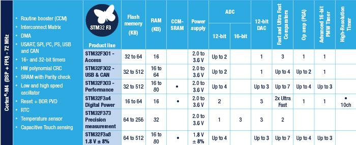

# [STM32F3](https://github.com/sochub/STM32F3)
 
#### 厂商：[ST](https://github.com/sochub/ST) 
#### 架构：[cortex M4](https://github.com/sochub/CM4)

## [描述](https://github.com/sochub/STM32F3/wiki) 

STM32F3系列与[STM32F1](https://github.com/sochub/STM32F1)系列引脚兼容，提供了cortex M3向cortex M4内核迁移途径，相比M4内核的[STM32F4](https://github.com/sochub/STM32F4)系列有更低的价格。

 

* [文档](docs/)
* [资源](src/)

### [收录型号](https://github.com/sochub/STM32F3)

* [STM32F301](https://github.com/sochub/STM32F301) 
* [STM32F303](https://github.com/sochub/STM32F303) 
* [STM32F373](https://github.com/sochub/STM32F373) 

### [选型建议](https://github.com/sochub)

[STM32F3](https://github.com/sochub/STM32F3)系列是ST针对机电控制类应用的主要产品，主要的竞争对象是[TI](https://github.com/sochub/TI) 相应解决方案。

##  [SoC资源平台](http://www.qitas.cn)  
